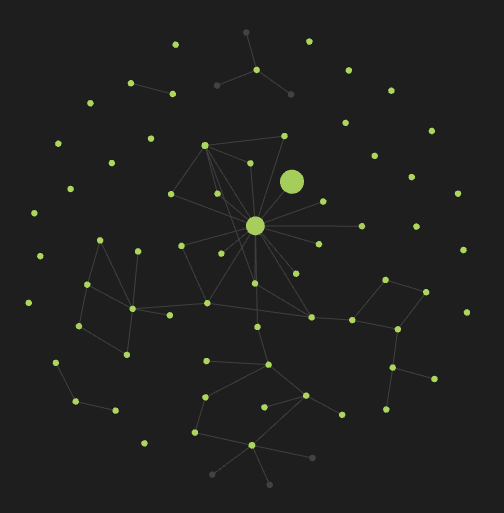

# Custom Node Size



# Usage

In your note, add property (`Ctrl+;` or `Ctrl+P` and `Add file property`) like this:
```markdown
---
node_size: 100
---
```

# Why?

Obsidian is the best thing I've ever found in my life. However, it was with sadness that I found that going into the graph, I cannot see the actual structure of my notes. Now Obsidian only increases the node weight if there are many notes referencing it. This is not always correct, especially if you are just starting out in Obsidian.

# How?

Each node has its own weight. This is the number of references to the note that makes the node larger. I overwrite this with the value you set in the properties in the `node_size` variable with `numeric` type.

# Restrictions

Experimentally, I found that visually the node changes in the range `[6, 100]`.

Warning: using a variable of a different type (not `numeric`) causes unexpected behavior.
